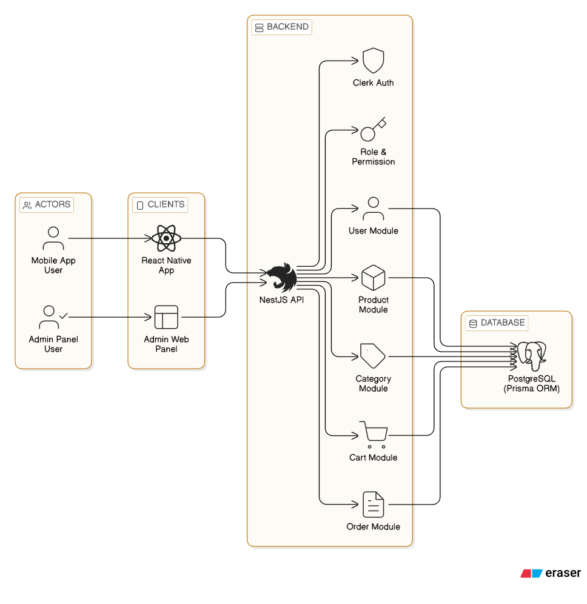
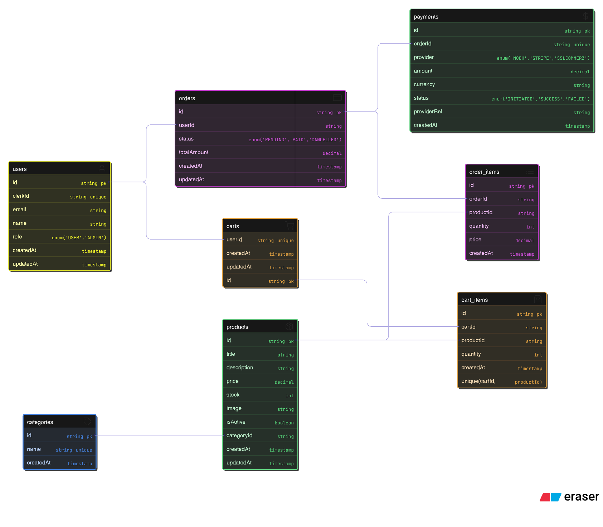

# 🛒 eCommerce Backend API (NestJS + Prisma)

A production-ready eCommerce backend built while learning real-world system design.
This project focuses on clean architecture, transactional safety, and secure payment
handling using industry best practices.

---

## 🚀 Features

### 🧑‍💻 Authentication

- Clerk-based authentication (user context)
- Secure user ownership validation

### 📦 Product & Category

- Category management
- Product stock tracking
- Stock-safe order processing

### 🛒 Cart System

- User-based cart
- Quantity & stock validation
- Prevents over-ordering
- Cart-to-order conversion

### 📑 Order Management

- Order creation from cart
- Order items snapshot (price-safe)
- User order history
- Admin order management

### 💳 Payment System (Phase 7)

- Multiple providers:
  - ✅ MOCK (for development & testing)
  - ✅ Stripe (Webhook-based flow)
  - ✅ SSLCommerz (IPN-based flow)
- Secure callback handling
- Transaction-based payment confirmation
- Payment failure recovery

### 🔐 Data Safety

- Prisma transactions
- Atomic stock updates
- Idempotent payment callbacks

---

## 🧱 System Architecture

> Architecture designed using **Eraser**

---

## 🗄️ Database Schema

> Prisma schema design (relational, scalable)

---

## 🛠️ Tech Stack

### Backend

- **NestJS** – scalable Node.js framework
- **Prisma ORM** – type-safe database access
- **PostgreSQL** – relational database

### Payments

- Stripe (Webhook-based)
- SSLCommerz (IPN-based)
- Mock Provider (local testing)

### Validation & Security

- class-validator
- DTO-based validation
- Role & ownership checks

---

## 📁 Project Structure

src/
├─ auth/
├─ users/
├─ categories/
├─ products/
├─ cart/
├─ orders/
├─ payments/
│ ├─ callbacks/
│ │ ├─ mock.callback.ts
│ │ ├─ stripe.callback.ts
│ │ └─ sslcommerz.callback.ts
│ ├─ payments.service.ts
│ └─ dto/
└─ prisma/

---

## 🔄 Payment Flow (Example)

1. User initiates payment
2. Payment record created (INITIATED)
3. User redirected to gateway
4. Gateway calls backend callback
5. Signature/IPN verified
6. Payment + Order updated in transaction

---

## 🧪 Development Mode

- Mock payment provider included
- No real gateway required to test full flow
- Safe for learning and local development

---

## 🎯 Learning Goals Behind This Project

- Real-world payment architecture
- Transaction safety
- Backend-driven checkout flow
- Clean separation of responsibilities
- Production mindset while learning

---

## 📌 Status

🚧 Actively developed  
✅ Core eCommerce flow complete  
🔜 Admin analytics & delivery flow

---

## 📄 License

MIT
